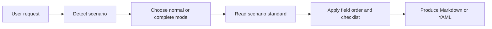

<p align="center">
  
</p>

<h1 align="center">oh-my-gh-writing</h1>

<p align="center">
  GitHub writing standards for AI agents, packaged as one portable skill.
</p>

<p align="center">
  <a href="./SKILL.md"></a>
  <a href="./INDEX.md"></a>
  <a href="./LICENSE"></a>
</p>

<p align="center">
  <a href="./README.md">中文</a> · English
</p>

---

`oh-my-gh-writing` is a GitHub writing standards skill for AI agents. It covers 18 common collaboration scenarios, including issues, pull requests, reviews, commits, README files, changelogs, release notes, RFCs, and GitHub templates.

It is not a README generator or a GitHub App. The project works as a portable writing standard: `SKILL.md` routes the request, `reference/` defines the scenario standards, and the agent produces ready-to-use Markdown or YAML.

## Quick Start

### Local Codex Install

Clone this repository or your fork first, then run this from the repository root:

```bash
mkdir -p "${CODEX_HOME:-$HOME/.codex}/skills"
ln -sfn "$PWD" "${CODEX_HOME:-$HOME/.codex}/skills/oh-my-gh-writing"
```

After restarting Codex, use prompts like:

```text
Use oh-my-gh-writing to write a bug report: the first page load is blank for 3 seconds in Chrome, but works in Firefox.

Use oh-my-gh-writing to write a feature PR: OAuth2 login has been implemented.

Use oh-my-gh-writing to write a README for a Rust CLI tool.
```

### Hermes Agent

Hermes CLI can install from a remote `SKILL.md` URL. Replace `<repo-owner>` with the GitHub owner for this repository or your fork.

```bash
hermes skills install \
  https://raw.githubusercontent.com/<repo-owner>/oh-my-gh-writing/main/SKILL.md \
  --name oh-my-gh-writing
```

### Other Agents

```bash
cp SKILL.md ./CLAUDE.md
cp -r reference/ ./reference/
```

If your agent supports a rules directory, rename `SKILL.md` to the target rules file and keep the `reference/` path available.

## Scenario Coverage

See the full index in [`INDEX.md`](./INDEX.md).

| Category | Count | Includes |
|----------|-------|----------|
| Issue | 4 | Bug Report, Feature Request, Enhancement, Discussion |
| PR | 4 | Feature PR, Bug Fix PR, Refactor PR, Documentation PR |
| Review / Commit | 2 | Code Review, Standard Commit |
| Docs | 3 | README, CONTRIBUTING, CHANGELOG |
| Release / Design | 3 | Release Notes, Migration Guide, RFC |
| Templates | 2 | Issue Form YAML, PR Template |

## How It Works



Default behavior:

- Use normal mode when complexity is not specified
- Use complete mode for formal, high-risk, release, or breaking-change work
- Produce a usable draft when information is missing, then mark the gaps clearly
- Preserve existing heading levels, date formats, labels, and link style when updating documents
- Prefer badge navigation, copyable commands, conditional sections, and compact structure for README work

## File Map

| File | Purpose |
|------|---------|
| [`SKILL.md`](./SKILL.md) | Skill entry: scenario routing, level selection, shared principles |
| [`INDEX.md`](./INDEX.md) | Full index for all 18 scenarios and their standards |
| [`reference/`](./reference) | Standardized writing rules, field order, and checklists per scenario |

Design notes and test reports are maintainer materials. Use [`INDEX.md`](./INDEX.md) when you need them.

## License

[MIT](./LICENSE)
