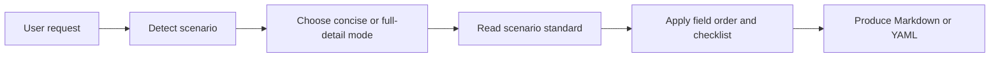

<h1 align="center">oh-my-gh-writing</h1>

<p align="center">
  
</p>

<p align="center">
  GitHub writing standards for AI agents, packaged as one portable skill.
</p>

<p align="center">
  <a href="./SKILL.md"></a>
  <a href="./INDEX.md"></a>
  <a href="./LICENSE"></a>
</p>

<p align="center">
  <a href="./README.md">中文</a> · English
</p>

---

`oh-my-gh-writing` is a GitHub writing standards skill for AI agents. It covers 18 common collaboration scenarios, including issues, pull requests, reviews, commits, README files, changelogs, release notes, RFCs, and GitHub templates.

It is not a README generator or a GitHub App. The project works as a portable writing standard: `SKILL.md` routes the request, `reference/` defines the scenario standards, and the agent produces ready-to-use Markdown or YAML.

## Quick Start

### Local Codex Install

Replace `<repo-url>` with this repository or your fork, then install with one command:

```bash
git clone <repo-url> "$HOME/.agents/skills/oh-my-gh-writing"
```

If you already have a local checkout, run this from the repository root:

```bash
mkdir -p "$HOME/.agents/skills"
ln -sfn "$PWD" "$HOME/.agents/skills/oh-my-gh-writing"
```

You can also hand this prompt to an agent:

```text
Install <repo-url> as a Codex skill named oh-my-gh-writing. If the target agent does not support SKILL.md skills, adapt SKILL.md and reference/ into that agent's native rule format.
```

After restarting Codex, use prompts like:

```text
Use oh-my-gh-writing to write a bug report: the first page load is blank for 3 seconds in Chrome, but works in Firefox.

Use oh-my-gh-writing to write a feature PR: OAuth2 login has been implemented.

Use oh-my-gh-writing to write a README for a Rust CLI tool.
```

### Agent Support Matrix

Support levels are checked against each agent's official documentation; each agent name links to the relevant docs. When adding or revising a use case, verify availability from official docs before writing the support claim.

| Icon | Agent | Support | How to connect it |
|------|-------|---------|-------------------|
|  | [Codex](https://developers.openai.com/codex/skills) | Direct skill folder install | Put this repository at `$HOME/.agents/skills/oh-my-gh-writing` or repo-local `.agents/skills/oh-my-gh-writing`, keeping both `SKILL.md` and `reference/` |
|  | [Hermes Agent](https://hermes-agent.nousresearch.com/docs/guides/work-with-skills) | Direct `SKILL.md` URL or skill folder install | Use `hermes skills install`; when full scenario rules are needed, make sure `reference/` is available inside the skill directory |
|  | [Claude Code](https://code.claude.com/docs/en/skills) | Direct skill folder install | Link this repository to `~/.claude/skills/oh-my-gh-writing` or project-local `.claude/skills/oh-my-gh-writing` |
|  | [Gemini CLI](https://geminicli.com/docs/cli/skills/) | Direct skill repository or local folder install | Use `gemini skills install <repo-url>`; for local development, use `/skills link "$PWD"` inside a Gemini session |
|  | [Cursor](https://cursor.com/docs/rules) | Adapt into Project Rules | Rewrite the `SKILL.md` workflow and the needed `reference/*.md` summaries into `.cursor/rules/oh-my-gh-writing.mdc` |
|  | [GitHub Copilot](https://docs.github.com/en/copilot/how-tos/copilot-on-github/customize-copilot/add-custom-instructions/add-repository-instructions) | Adapt into custom instructions | Put the core rules in `.github/copilot-instructions.md`; split scenario-specific rules into `.github/instructions/*.instructions.md` when needed |

### Example: Direct Hermes Agent Install

Hermes CLI can install from a remote `SKILL.md` URL. Replace `<repo-owner>` with the GitHub owner for this repository or your fork.

```bash
hermes skills install \
  https://raw.githubusercontent.com/<repo-owner>/oh-my-gh-writing/main/SKILL.md \
  --name oh-my-gh-writing
```

If your Hermes setup downloads only the single `SKILL.md` and cannot read this repository's `reference/`, install the whole folder instead:

```bash
mkdir -p "$HOME/.hermes/skills"
ln -sfn "$PWD" "$HOME/.hermes/skills/oh-my-gh-writing"
```

### Example: Adapt for Cursor

Cursor does not load this repository as a `SKILL.md` skill folder directly. The easiest path is to ask an agent to convert it inside the target project:

```text
Read oh-my-gh-writing's SKILL.md and reference/, then adapt them into Cursor Project Rules:
1. Create .cursor/rules/oh-my-gh-writing.mdc
2. Preserve scenario routing, concise/full-detail mode selection, and README guardrails
3. Reference or inline the relevant reference/*.md summaries when needed
4. Do not treat the case library as runtime rules; use it only when I ask for examples
```

If you do it manually, the minimum rule file is `.cursor/rules/oh-my-gh-writing.mdc`, derived from `SKILL.md`'s Workflow, Scenario Routing, and Shared Principles.

## Scenario Coverage

See the full index in [`INDEX.md`](./INDEX.md).

| Category | Count | Includes |
|----------|-------|----------|
| Issue | 4 | Bug Report, Feature Request, Enhancement, Discussion |
| PR | 4 | Feature PR, Bug Fix PR, Refactor PR, Documentation PR |
| Review / Commit | 2 | Code Review, Standard Commit |
| Docs | 3 | README, CONTRIBUTING, CHANGELOG |
| Release / Design | 3 | Release Notes, Migration Guide, RFC |
| Templates | 2 | Issue Form YAML, PR Template |

## How It Works



Default behavior:

- Use concise mode when complexity is not specified
- Use full-detail mode for formal, high-risk, release, or breaking-change work
- Produce a usable draft when information is missing, then mark the gaps clearly
- Preserve existing heading levels, date formats, labels, and link style when updating documents
- Prefer badge navigation, copyable commands, conditional sections, and compact structure for README work

## File Map

| File | Purpose |
|------|---------|
| [`SKILL.md`](./SKILL.md) | Skill entry: scenario routing, level selection, shared principles |
| [`INDEX.md`](./INDEX.md) | Full index for all 18 scenarios and their standards |
| [`reference/`](./reference) | Standardized writing rules, field order, and checklists per scenario |
| [`案例/`](./案例) | Current case library: source links, excerpts, and structure notes from real repositories |

## Viewing Cases

Open [`案例/README.md`](./案例/README.md) for the 18-scenario case index. GitHub renders these Markdown files directly. README cases also include a rendered-view link to the original repository README, while the raw-source link remains available for comparing the underlying Markdown.

## License

[MIT](./LICENSE)
