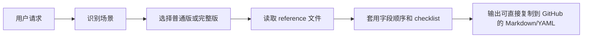

<p align="center">
  
</p>

<h1 align="center">oh-my-gh-writing</h1>

<p align="center">
  GitHub 写作规范 skill：让 AI agent 稳定产出 Issue、PR、Review、Commit、README、CHANGELOG、Release Notes、RFC 和模板文件。
</p>

<p align="center">
  <em>GitHub writing standards for agents, packaged as one portable SKILL.md.</em>
</p>

<p align="center">
  <a href="./SKILL.md"></a>
  <a href="./INDEX.md"></a>
  <a href="./test/README.md"></a>
  <a href="./reference"></a>
  <a href="./reference/tool-analysis.md"></a>
  <a href="./LICENSE"></a>
</p>

<p align="center">
  <a href="#quick-start">Quick Start</a> ·
  <a href="./INDEX.md">完整索引</a> ·
  <a href="./DOCS/README.md">文档目录</a> ·
  <a href="#测试">测试</a> ·
  <a href="#参考项目">参考项目</a>
</p>

---

## 这是什么

`oh-my-gh-writing` 是一个面向 AI agent 的 GitHub 写作 skill。它把常见开源协作文本拆成 18 个场景，每个场景都有：

- 普通版：日常使用，字段齐全但不过度展开
- 完整版：高风险变更、正式设计、发布说明等需要更多上下文的场景
- 参考文件：写法结构、必含字段、可选项、真实仓库参考链接
- 自检 checklist：生成后快速检查是否缺复现、测试、兼容性、链接或 labels

它不是 README 生成器或 GitHub App，而是一套可移植的写作规范。把 `SKILL.md` 和 `reference/` 放到 agent 能读取的位置，agent 就能按这些规则写 GitHub 内容。

## 阅读路径

| 你要做什么 | 去哪里 |
|------------|--------|
| 立刻使用 skill | [`SKILL.md`](./SKILL.md) |
| 找某个场景的标准 | [`INDEX.md`](./INDEX.md) |
| 理解文档结构 | [`DOCS/README.md`](./DOCS/README.md) |
| 看完整写法细节 | [`reference/`](./reference) |
| 跑 18 场景测试 | [`test/README.md`](./test/README.md) |

## Quick Start

### Codex 本地安装

```bash
git clone git@github.com:PINKIIILQWQ/oh-my-gh-writing.git
cd oh-my-gh-writing

mkdir -p "$HOME/.codex/skills"
ln -s "$PWD" "$HOME/.codex/skills/oh-my-gh-writing"
```

重启 Codex 后，可以这样使用：

```text
使用 oh-my-gh-writing，写一份 Bug Report：Chrome 下首次加载页面白屏 3 秒，Firefox 正常

使用 oh-my-gh-writing，写一份 Feature PR：实现了 OAuth2 登录功能

使用 oh-my-gh-writing，写一个 Rust CLI 工具的 README
```

### Hermes Agent

Hermes CLI 支持从远程 `SKILL.md` URL 安装：

```bash
hermes skills install \
  https://raw.githubusercontent.com/PINKIIILQWQ/oh-my-gh-writing/main/SKILL.md \
  --name oh-my-gh-writing
```

### 其他 agent

```bash
# Claude Code / Cursor / Windsurf / Cline / Aider / Codex CLI 等
cp SKILL.md ./CLAUDE.md
cp -r reference/ ./reference/
```

如果目标 agent 支持规则目录，也可以把 `SKILL.md` 改名为对应规则文件，并保持 `reference/` 相对路径可访问。

## 场景总览

`oh-my-gh-writing` 覆盖 18 个 GitHub 写作场景，完整表格见 [`INDEX.md`](./INDEX.md)。

| 类别 | 场景数 | 包含 |
|------|--------|------|
| Issue | 4 | Bug Report, Feature Request, Enhancement, Discussion |
| PR | 4 | Feature PR, Bug Fix PR, Refactor PR, Documentation PR |
| Review / Commit | 2 | Code Review, Standard Commit |
| Docs | 3 | README, CONTRIBUTING, CHANGELOG |
| Release / Design | 3 | Release Notes, Migration Guide, RFC |
| Templates | 2 | Issue Form YAML, PR Template |

## 工作方式

`SKILL.md` 是入口索引，负责识别用户要写的 GitHub 文本类型，并指向对应 `reference/*.md`。



默认策略：

- 未说明复杂度时，用普通版，保证必要字段完整
- 用户说“完整版”“正式发布”“高风险”“Breaking Change”时，用完整版
- 信息不足时，先补出可用草稿，再明确标注缺失字段
- 更新已有文档时，优先沿用原文件的标题层级、日期格式、label 分类和链接风格
- README 场景会优先使用徽章导航、可复制命令、条件渲染和紧凑目录

## 项目结构

```text
oh-my-gh-writing/
├── INDEX.md                    # 全量索引：场景、目录、文档、测试
├── SKILL.md                    # skill 入口：索引、原则、场景摘要
├── DOCS/
│   ├── README.md               # 文档目录和渐进式披露规则
│   ├── collection-plan.md
│   ├── skill-outline.md
│   └── skill-outline-v2.md
├── reference/                  # 18 个场景标准 + 工具分析 + 格式武器库
│   ├── readme.md               # README 写法、徽章策略、页面结构
│   ├── feature-pr.md
│   ├── release-notes.md
│   ├── tool-analysis.md        # 6 个专项工具/仓库的写法分析
│   └── weapons.md              # badges、alerts、details、mermaid 等格式工具
├── test/
│   ├── README.md               # 18 场景测试索引
│   └── compare-18-scenarios.md # 完整版/精简版对比样例
├── assets/
│   └── oh-my-gh-writing-logo.png
└── README.md
```

## 测试

全量测试入口在 [`test/README.md`](./test/README.md)。它覆盖 18 个场景，每个场景用一条真实提示词检查输出结构。

```bash
# 静态完整性检查示例
for f in reference/*.md; do
  grep -q "Checklist" "$f" || echo "missing checklist: $f"
done
```

当前测试材料：

- [`test/README.md`](./test/README.md)：18 场景索引、预期产出和测试流程
- [`test/compare-18-scenarios.md`](./test/compare-18-scenarios.md)：每场景完整版与精简版样例
- [`reference/*.md`](./reference)：每场景的必含元素 checklist

## 参考项目

这个 skill 参考的是“写作结构”和“信息组织方式”，不是复制实现。

| 参考 | 借鉴点 |
|------|--------|
| [`rahuldkjain/github-profile-readme-generator`](https://github.com/rahuldkjain/github-profile-readme-generator) | README 模块化、可选 section、统计卡片和视觉入口 |
| [`The-PR-Agent/pr-agent`](https://github.com/The-PR-Agent/pr-agent) | PR 描述 schema、代码变更摘要、结构化审查输出 |
| [`kefranabg/readme-md-generator`](https://github.com/kefranabg/readme-md-generator) | 从项目元数据生成 README、条件渲染、固定字段顺序 |
| [`github-changelog-generator/github-changelog-generator`](https://github.com/github-changelog-generator/github-changelog-generator) | label 到 changelog section 的映射、版本时间线 |
| [`release-drafter/release-drafter`](https://github.com/release-drafter/release-drafter) | release draft 持续累积、模板变量、分类聚合 |
| [`pudding0503/github-badge-collection`](https://github.com/pudding0503/github-badge-collection) | badge 分类、复制友好、导航密度和 README 徽章策略 |

对应分析在 [`reference/tool-analysis.md`](./reference/tool-analysis.md)，README 写法细则在 [`reference/readme.md`](./reference/readme.md)。

## 维护准则

- README 中的场景数量必须和 `SKILL.md`、`test/README.md` 保持一致
- 新增场景时，同时补 `reference/<scenario>.md`、测试提示词和 [`INDEX.md`](./INDEX.md)
- 新增文档时，先登记到 [`DOCS/README.md`](./DOCS/README.md)，再按需要挂到 [`INDEX.md`](./INDEX.md)
- 新增参考仓库时，只记录可复用的结构思路，不复制模板代码
- badge 不追求多，优先选择能跳转到真实信息的徽章

## License

[MIT](./LICENSE)
