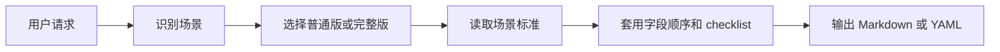
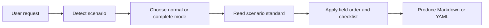

<p align="center">
  
</p>

<h1 align="center">oh-my-gh-writing</h1>

<p align="center">
  GitHub writing standards for AI agents, packaged as one portable skill.
</p>

<p align="center">
  <a href="./SKILL.md"></a>
  <a href="./INDEX.md"></a>
  <a href="./LICENSE"></a>
</p>

<p align="center">
  <a href="#中文">中文</a> ·
  <a href="#english">English</a>
</p>

---

<a id="中文"></a>

## 中文

`oh-my-gh-writing` 是一套面向 AI agent 的 GitHub 写作规范。它覆盖 Issue、PR、Review、Commit、README、CHANGELOG、Release Notes、RFC 和模板文件等 18 个常见场景，让 agent 在不同仓库里也能稳定输出结构清晰、信息完整、可直接粘贴到 GitHub 的内容。

它不是 README 生成器，也不是 GitHub App。它的核心是一个 `SKILL.md` 入口和一组 `reference/` 场景标准：先识别你要写什么，再按对应场景选择普通版或完整版，最后输出 Markdown 或 YAML。

### Quick Start

#### Codex 本地安装

先克隆本仓库或你的 fork，然后在仓库根目录执行：

```bash
mkdir -p "${CODEX_HOME:-$HOME/.codex}/skills"
ln -sfn "$PWD" "${CODEX_HOME:-$HOME/.codex}/skills/oh-my-gh-writing"
```

重启 Codex 后，可以这样使用：

```text
使用 oh-my-gh-writing，写一份 Bug Report：Chrome 下首次加载页面白屏 3 秒，Firefox 正常

使用 oh-my-gh-writing，写一份 Feature PR：实现了 OAuth2 登录功能

使用 oh-my-gh-writing，写一个 Rust CLI 工具的 README
```

#### Hermes Agent

Hermes CLI 支持从远程 `SKILL.md` URL 安装：

将 `<repo-owner>` 替换为本仓库或你的 fork 所属的 GitHub owner。

```bash
hermes skills install \
  https://raw.githubusercontent.com/<repo-owner>/oh-my-gh-writing/main/SKILL.md \
  --name oh-my-gh-writing
```

#### 其他 agent

```bash
cp SKILL.md ./CLAUDE.md
cp -r reference/ ./reference/
```

如果目标 agent 支持规则目录，也可以把 `SKILL.md` 改名为对应规则文件，并保持 `reference/` 相对路径可访问。

### 场景总览

完整索引见 [`INDEX.md`](./INDEX.md)。

| 类别 | 场景数 | 包含 |
|------|--------|------|
| Issue | 4 | Bug Report, Feature Request, Enhancement, Discussion |
| PR | 4 | Feature PR, Bug Fix PR, Refactor PR, Documentation PR |
| Review / Commit | 2 | Code Review, Standard Commit |
| Docs | 3 | README, CONTRIBUTING, CHANGELOG |
| Release / Design | 3 | Release Notes, Migration Guide, RFC |
| Templates | 2 | Issue Form YAML, PR Template |

### 工作方式



默认策略：

- 未说明复杂度时，用普通版，保证必要字段完整
- 用户说“完整版”“正式发布”“高风险”“Breaking Change”时，用完整版
- 信息不足时，先补出可用草稿，再明确标注缺失字段
- 更新已有文档时，优先沿用原文件的标题层级、日期格式、label 分类和链接风格
- README 场景优先使用徽章导航、可复制命令、条件渲染和紧凑目录

### 文件定位

| 文件 | 作用 |
|------|------|
| [`SKILL.md`](./SKILL.md) | skill 入口：识别场景、选择级别、说明通用原则 |
| [`INDEX.md`](./INDEX.md) | 全量索引：18 个场景和对应标准文件 |
| [`reference/`](./reference) | 每个场景的标准化写法、字段顺序和 checklist |

设计过程和测试记录属于维护材料，需要时从 [`INDEX.md`](./INDEX.md) 进入。

## License

[MIT](./LICENSE)

---

<a id="english"></a>

## English

`oh-my-gh-writing` is a GitHub writing standards skill for AI agents. It covers 18 common collaboration scenarios, including issues, pull requests, reviews, commits, README files, changelogs, release notes, RFCs, and GitHub templates.

It is not a README generator or a GitHub App. The project works as a portable writing standard: `SKILL.md` routes the request, `reference/` defines the scenario standards, and the agent produces ready-to-use Markdown or YAML.

### Quick Start

#### Local Codex install

Clone this repository or your fork first, then run this from the repository root:

```bash
mkdir -p "${CODEX_HOME:-$HOME/.codex}/skills"
ln -sfn "$PWD" "${CODEX_HOME:-$HOME/.codex}/skills/oh-my-gh-writing"
```

After restarting Codex, use prompts like:

```text
Use oh-my-gh-writing to write a bug report: the first page load is blank for 3 seconds in Chrome, but works in Firefox.

Use oh-my-gh-writing to write a feature PR: OAuth2 login has been implemented.

Use oh-my-gh-writing to write a README for a Rust CLI tool.
```

#### Hermes Agent

Replace `<repo-owner>` with the GitHub owner for this repository or your fork.

```bash
hermes skills install \
  https://raw.githubusercontent.com/<repo-owner>/oh-my-gh-writing/main/SKILL.md \
  --name oh-my-gh-writing
```

#### Other agents

```bash
cp SKILL.md ./CLAUDE.md
cp -r reference/ ./reference/
```

If your agent supports a rules directory, rename `SKILL.md` to the target rules file and keep the `reference/` path available.

### Scenario Coverage

See the full index in [`INDEX.md`](./INDEX.md).

| Category | Count | Includes |
|----------|-------|----------|
| Issue | 4 | Bug Report, Feature Request, Enhancement, Discussion |
| PR | 4 | Feature PR, Bug Fix PR, Refactor PR, Documentation PR |
| Review / Commit | 2 | Code Review, Standard Commit |
| Docs | 3 | README, CONTRIBUTING, CHANGELOG |
| Release / Design | 3 | Release Notes, Migration Guide, RFC |
| Templates | 2 | Issue Form YAML, PR Template |

### How It Works



Default behavior:

- Use normal mode when complexity is not specified
- Use complete mode for formal, high-risk, release, or breaking-change work
- Produce a usable draft when information is missing, then mark the gaps clearly
- Preserve existing heading levels, date formats, labels, and link style when updating documents
- Prefer badge navigation, copyable commands, conditional sections, and compact structure for README work

### File Map

| File | Purpose |
|------|---------|
| [`SKILL.md`](./SKILL.md) | Skill entry: scenario routing, level selection, shared principles |
| [`INDEX.md`](./INDEX.md) | Full index for all 18 scenarios and their standards |
| [`reference/`](./reference) | Standardized writing rules, field order, and checklists per scenario |

Design notes and test reports are maintainer materials. Use [`INDEX.md`](./INDEX.md) when you need them.

## License

[MIT](./LICENSE)
