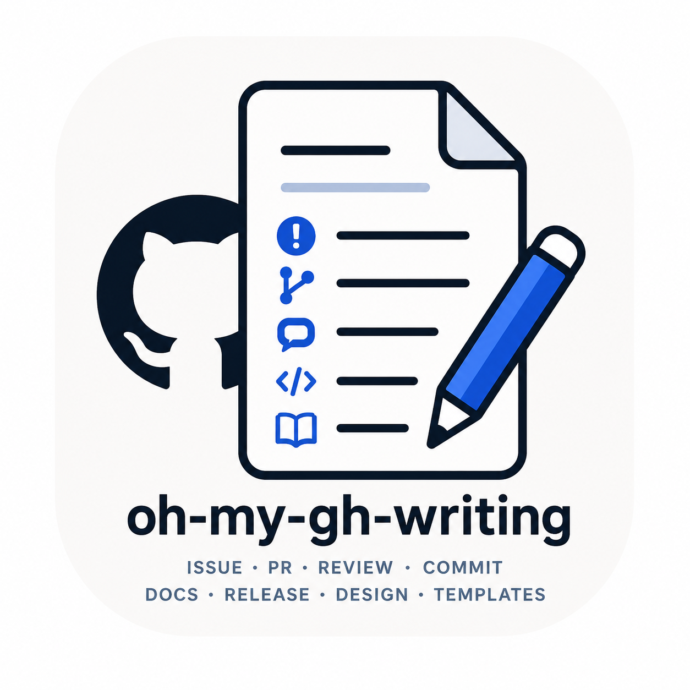
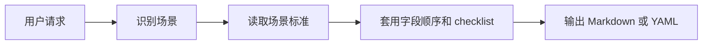

<h1 align="center">oh-my-gh-writing</h1>

<p align="center">
  
</p>

<p align="center">
  面向 AI agent 的 GitHub 写作规范，打包成一个可移植 skill。
</p>

<p align="center">
  <a href="./SKILL.md"></a>
  <a href="./INDEX.md"></a>
  <a href="./LICENSE"></a>
</p>

<p align="center">
  中文 · <a href="./README.en.md">English</a>
</p>

---

`oh-my-gh-writing` 是一套面向 AI agent 的 GitHub 写作操作系统。它覆盖 Issue、PR、Review、Commit、README、CHANGELOG、Release Notes、RFC 和模板文件等 18 个常见场景，让 agent 在不同仓库里也能稳定判断场景、守住事实边界，并输出结构清晰、可直接粘贴到 GitHub 的内容。

它不是 README 生成器，也不是 GitHub App。它的核心是一个 `SKILL.md` 入口和一组 `reference/` 场景标准：先识别你要写什么，再读取对应场景标准，最后输出 Markdown 或 YAML。

## Quick Start

### Codex 本地安装

把 `<repo-url>` 替换成这个仓库或你的 fork，一条命令安装：

```bash
git clone <repo-url> "$HOME/.agents/skills/oh-my-gh-writing"
```

如果已经克隆到本地，在仓库根目录执行：

```bash
mkdir -p "$HOME/.agents/skills"
ln -sfn "$PWD" "$HOME/.agents/skills/oh-my-gh-writing"
```

也可以直接把这句话丢给 agent：

```text
请把 <repo-url> 安装成 Codex skill，名称为 oh-my-gh-writing；如果目标 agent 不支持 SKILL.md skill，请把 SKILL.md 和 reference/ 改写成它的原生规则文件。
```

重启 Codex 后，可以这样使用：

```text
使用 oh-my-gh-writing，写一份 Bug Report：Chrome 下首次加载页面白屏 3 秒，Firefox 正常

使用 oh-my-gh-writing，写一份 Feature PR：实现了 OAuth2 登录功能

使用 oh-my-gh-writing，写一个 Rust CLI 工具的 README
```

### Agent 支持矩阵

支持方式按各 Agent 官方文档核对，Agent 名称链接到对应文档。新增或更新接入说明时，不要凭经验判断是否可用，先查官方文档再写结论。

| 图标 | Agent | 支持方式 | 如何接入 |
|------|-------|----------|----------|
|  | [Codex](https://developers.openai.com/codex/skills) | 直接安装 skill 文件夹 | 将本仓库放到 `$HOME/.agents/skills/oh-my-gh-writing` 或仓库内 `.agents/skills/oh-my-gh-writing`，保留 `SKILL.md` 和 `reference/` |
|  | [Hermes Agent](https://hermes-agent.nousresearch.com/docs/guides/work-with-skills) | 直接安装 `SKILL.md` URL 或 skill 文件夹 | 用 `hermes skills install` 安装；需要完整场景标准时，确保 `reference/` 也在 skill 目录里 |
|  | [Claude Code](https://code.claude.com/docs/en/skills) | 直接安装 skill 文件夹 | 将本仓库链接到 `~/.claude/skills/oh-my-gh-writing` 或项目内 `.claude/skills/oh-my-gh-writing` |
|  | [Gemini CLI](https://geminicli.com/docs/cli/skills/) | 直接安装 skill 仓库或本地文件夹 | 用 `gemini skills install <repo-url>` 安装；本地开发时在 Gemini 会话中用 `/skills link "$PWD"` |
|  | [Cursor](https://cursor.com/docs/rules) | 需要改写为 Project Rules | 把 `SKILL.md` 的工作流和需要的 `reference/*.md` 摘要改写到 `.cursor/rules/oh-my-gh-writing.mdc` |
|  | [GitHub Copilot](https://docs.github.com/en/copilot/how-tos/copilot-on-github/customize-copilot/add-custom-instructions/add-repository-instructions) | 需要改写为自定义指令 | 把核心原则写入 `.github/copilot-instructions.md`，按场景拆分时使用 `.github/instructions/*.instructions.md` |

### 示例：Hermes Agent 直接安装

Hermes CLI 支持从远程 `SKILL.md` URL 安装。将 `<repo-owner>` 替换为本仓库或你的 fork 所属的 GitHub owner。

```bash
hermes skills install \
  https://raw.githubusercontent.com/<repo-owner>/oh-my-gh-writing/main/SKILL.md \
  --name oh-my-gh-writing
```

如果你的 Hermes 配置只下载单个 `SKILL.md`，而不能读取本仓库的 `reference/`，请改用完整文件夹安装：

```bash
mkdir -p "$HOME/.hermes/skills"
ln -sfn "$PWD" "$HOME/.hermes/skills/oh-my-gh-writing"
```

### 示例：Cursor 改写导入

Cursor 不按 `SKILL.md` 目录直接加载本仓库。推荐让 agent 在目标项目里完成转换：

```text
请读取 oh-my-gh-writing 的 SKILL.md 和 reference/，把它改写成 Cursor Project Rules：
1. 创建 .cursor/rules/oh-my-gh-writing.mdc
2. 保留场景路由、证据边界和 README guardrails
3. 让规则在需要时引用或内嵌对应 reference/*.md 摘要
4. 不要把案例库当成运行时规则，只在我要求案例时参考
```

如果手工做，最小规则文件就是 `.cursor/rules/oh-my-gh-writing.mdc`，内容来自 `SKILL.md` 的 Workflow、Scenario Routing 和 Shared Principles。

## 场景总览

完整索引见 [`INDEX.md`](./INDEX.md)。

| 类别 | 场景数 | 包含 |
|------|--------|------|
| Issue | 4 | Bug Report, Feature Request, Enhancement, Discussion |
| PR | 4 | Feature PR, Bug Fix PR, Refactor PR, Documentation PR |
| Review / Commit | 2 | Code Review, Standard Commit |
| Docs | 3 | README, CONTRIBUTING, CHANGELOG |
| Release / Design | 3 | Release Notes, Migration Guide, RFC |
| Templates | 2 | Issue Form YAML, PR Template |

## 工作方式



默认策略：

- 默认输出可直接用于 GitHub 的完整草稿
- 信息不足时，先补出可用草稿，再明确标注缺失字段
- 更新已有文档时，优先沿用原文件的标题层级、日期格式、label 分类和链接风格
- README 场景优先使用徽章导航、可复制命令、条件渲染和紧凑目录

## 文件定位

| 文件 | 作用 |
|------|------|
| [`SKILL.md`](./SKILL.md) | skill 入口：识别场景、说明通用原则 |
| [`INDEX.md`](./INDEX.md) | 全量索引：18 个场景和对应标准文件 |
| [`reference/`](./reference) | 每个场景的标准化写法、字段顺序、checklist 和输出验收 |
| [`案例/`](./案例) | 当前案例库：真实仓库来源、摘录和结构分析 |
| [`效果测试/`](./效果测试) | 18 个场景的固定输入和标准输出效果 |

最终输出前的清洁和事实边界检查见 [`reference/output-validation.md`](./reference/output-validation.md)。

## 查看案例效果

打开 [`案例/README.md`](./案例/README.md) 可以看到 18 个场景的案例索引。GitHub 会直接渲染这些 Markdown 文件；README 场景还提供“渲染效果”链接，可以跳到原仓库 README 的最终展示页，旁边的“完整内容”链接保留 raw Markdown 方便比对。

## 查看输出效果

打开 [`效果测试/README.md`](./效果测试/README.md) 可以按场景查看固定输入 prompt 和标准输出。这个目录适合用来比较 skill 调整前后的实际写作效果。

## 致谢

README 徽章和 GitHub 视觉入口规则参考了 [pudding0503/github-badge-collection](https://github.com/pudding0503/github-badge-collection)。本仓库只吸收结构原则和链接出处，不复制其徽章合集或素材文件。

## License

[MIT](./LICENSE)
