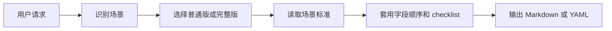

<p align="center">
  
</p>

<h1 align="center">oh-my-gh-writing</h1>

<p align="center">
  面向 AI agent 的 GitHub 写作规范，打包成一个可移植 skill。
</p>

<p align="center">
  <a href="./SKILL.md"></a>
  <a href="./INDEX.md"></a>
  <a href="./LICENSE"></a>
</p>

<p align="center">
  中文 · <a href="./README.en.md">English</a>
</p>

---

`oh-my-gh-writing` 是一套面向 AI agent 的 GitHub 写作规范。它覆盖 Issue、PR、Review、Commit、README、CHANGELOG、Release Notes、RFC 和模板文件等 18 个常见场景，让 agent 在不同仓库里也能稳定输出结构清晰、信息完整、可直接粘贴到 GitHub 的内容。

它不是 README 生成器，也不是 GitHub App。它的核心是一个 `SKILL.md` 入口和一组 `reference/` 场景标准：先识别你要写什么，再按对应场景选择普通版或完整版，最后输出 Markdown 或 YAML。

## Quick Start

### Codex 本地安装

先克隆本仓库或你的 fork，然后在仓库根目录执行：

```bash
mkdir -p "${CODEX_HOME:-$HOME/.codex}/skills"
ln -sfn "$PWD" "${CODEX_HOME:-$HOME/.codex}/skills/oh-my-gh-writing"
```

重启 Codex 后，可以这样使用：

```text
使用 oh-my-gh-writing，写一份 Bug Report：Chrome 下首次加载页面白屏 3 秒，Firefox 正常

使用 oh-my-gh-writing，写一份 Feature PR：实现了 OAuth2 登录功能

使用 oh-my-gh-writing，写一个 Rust CLI 工具的 README
```

### Hermes Agent

Hermes CLI 支持从远程 `SKILL.md` URL 安装。将 `<repo-owner>` 替换为本仓库或你的 fork 所属的 GitHub owner。

```bash
hermes skills install \
  https://raw.githubusercontent.com/<repo-owner>/oh-my-gh-writing/main/SKILL.md \
  --name oh-my-gh-writing
```

### 其他 agent

```bash
cp SKILL.md ./CLAUDE.md
cp -r reference/ ./reference/
```

如果目标 agent 支持规则目录，也可以把 `SKILL.md` 改名为对应规则文件，并保持 `reference/` 相对路径可访问。

## 场景总览

完整索引见 [`INDEX.md`](./INDEX.md)。

| 类别 | 场景数 | 包含 |
|------|--------|------|
| Issue | 4 | Bug Report, Feature Request, Enhancement, Discussion |
| PR | 4 | Feature PR, Bug Fix PR, Refactor PR, Documentation PR |
| Review / Commit | 2 | Code Review, Standard Commit |
| Docs | 3 | README, CONTRIBUTING, CHANGELOG |
| Release / Design | 3 | Release Notes, Migration Guide, RFC |
| Templates | 2 | Issue Form YAML, PR Template |

## 工作方式



默认策略：

- 未说明复杂度时，用普通版，保证必要字段完整
- 用户说“完整版”“正式发布”“高风险”“Breaking Change”时，用完整版
- 信息不足时，先补出可用草稿，再明确标注缺失字段
- 更新已有文档时，优先沿用原文件的标题层级、日期格式、label 分类和链接风格
- README 场景优先使用徽章导航、可复制命令、条件渲染和紧凑目录

## 文件定位

| 文件 | 作用 |
|------|------|
| [`SKILL.md`](./SKILL.md) | skill 入口：识别场景、选择级别、说明通用原则 |
| [`INDEX.md`](./INDEX.md) | 全量索引：18 个场景和对应标准文件 |
| [`reference/`](./reference) | 每个场景的标准化写法、字段顺序和 checklist |

设计过程和测试记录属于维护材料，需要时从 [`INDEX.md`](./INDEX.md) 进入。

## License

[MIT](./LICENSE)
