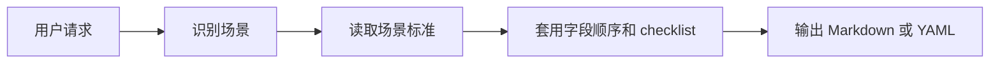

<p align="center">
  
</p>

<h1 align="center">oh-my-gh-writing</h1>

<p align="center">
  面向 AI Agent 的 GitHub 写作规范，打包成一个可移植 skill。
</p>

<p align="center">
  <a href="./SKILL.md"></a>
  <a href="./INDEX.md"></a>
  <a href="./LICENSE"></a>
</p>

<p align="center">
  <a href="./README.md">简体中文</a> ·
  <a href="./README.en.md">English</a> ·
  <a href="./README.es.md">Español</a> ·
  <a href="./README.hi.md">हिन्दी</a> ·
  <a href="./README.ar.md">العربية</a> ·
  <a href="./README.fr.md">Français</a> ·
  <a href="./README.pt.md">Português</a> ·
  <a href="./README.ja.md">日本語</a> ·
  <a href="./README.ko.md">한국어</a>
</p>

---

`oh-my-gh-writing` 是一套面向 AI Agent 的 GitHub 写作操作系统。它覆盖 Issue、PR、Review、Commit、README、CHANGELOG、Release Notes、RFC 和模板文件等 **18 个常见场景**，让 Agent 在不同仓库里也能稳定判断场景、守住事实边界，并输出结构清晰、可直接粘贴到 GitHub 的内容。

它不是 README 生成器，也不是 GitHub App。它的核心是一个 `SKILL.md` 入口和一组 `reference/` 场景标准：先识别你要写什么，再读取对应场景标准，最后输出 Markdown 或 YAML。

---

## 目录

- [Quick Start](#quick-start)
- [Agent 支持矩阵](#agent-支持矩阵)
- [18 场景总览](#18-场景总览)
- [工作方式](#工作方式)
- [文件定位](#文件定位)
- [安装示例：Hermes Agent](#安装示例hermes-agent)
- [安装示例：Cursor 改写导入](#安装示例cursor-改写导入)
- [致谢](#致谢)
- [License](#license)

---

## Quick Start

### Codex 本地安装

一条命令安装到 Codex 用户 skill 目录：

```bash
git clone https://github.com/PINKIIILQWQ/oh-my-gh-writing.git "$HOME/.agents/skills/oh-my-gh-writing"
```

如果已经克隆到本地，在仓库根目录执行：

```bash
mkdir -p "$HOME/.agents/skills"
ln -sfn "$PWD" "$HOME/.agents/skills/oh-my-gh-writing"
```

重启 Codex 后，可以这样使用：

```text
使用 oh-my-gh-writing，写一份 Bug Report：Chrome 下首次加载页面白屏 3 秒，Firefox 正常

使用 oh-my-gh-writing，写一份 Feature PR：实现了 OAuth2 登录功能

使用 oh-my-gh-writing，写一个 Rust CLI 工具的 README
```

### 直接使用

如果你使用的 Agent 支持直接加载 skill 文件夹（Codex、Hermes Agent、Claude Code），只需将本仓库链接或克隆到对应 skill 目录。Agent 会在匹配场景时自动读取 `SKILL.md` 和对应的 `reference/*.md` 场景标准。

---

## Agent 支持矩阵

支持方式按各 Agent 官方文档核对。新增或更新接入说明时，先查官方文档再写结论。

| 图标 | Agent | 支持方式 | 如何接入 |
|------|-------|----------|----------|
|  | [Codex](https://developers.openai.com/codex/skills) | 直接安装 skill 文件夹 | 将本仓库放到 `$HOME/.agents/skills/oh-my-gh-writing` 或仓库内 `.agents/skills/oh-my-gh-writing`，保留 `SKILL.md` 和 `reference/` |
|  | [Hermes Agent](https://hermes-agent.nousresearch.com/docs/guides/work-with-skills) | 直接安装 `SKILL.md` URL 或 skill 文件夹 | 用 `hermes skills install` 安装；需要完整场景标准时，确保 `reference/` 也在 skill 目录里 |
|  | [Claude Code](https://code.claude.com/docs/en/skills) | 直接安装 skill 文件夹 | 将本仓库链接到 `~/.claude/skills/oh-my-gh-writing` 或项目内 `.claude/skills/oh-my-gh-writing` |
|  | [Gemini CLI / Antigravity CLI](https://geminicli.com/docs/cli/skills/) | 需按当前官方文档确认 | Gemini CLI 当前支持 Agent Skills 和 `gemini skills install`，但可用范围正在迁移；发布前按官方说明确认 Gemini CLI 或 Antigravity CLI 的实际接入方式 |
|  | [Cursor](https://cursor.com/docs/rules) | 需要改写为 Project Rules | 把 `SKILL.md` 的工作流和需要的 `reference/*.md` 摘要改写到 `.cursor/rules/oh-my-gh-writing.mdc` |
|  | [GitHub Copilot](https://docs.github.com/en/copilot/how-tos/copilot-on-github/customize-copilot/add-custom-instructions/add-repository-instructions) | 需要改写为自定义指令 | 把核心原则写入 `.github/copilot-instructions.md`，按场景拆分时使用 `.github/instructions/*.instructions.md` |

---

## 18 场景总览

| 类别 | 场景 | 标准文件 |
|------|------|----------|
| **Issue** | Bug Report / Feature Request / Enhancement / Discussion | `reference/bug-report.md` · `feature-request.md` · `enhancement.md` · `discussion.md` |
| **PR** | Feature PR / Bug Fix PR / Refactor PR / Documentation PR | `reference/feature-pr.md` · `bug-fix-pr.md` · `refactor-pr.md` · `documentation-pr.md` |
| **Review / Commit** | Code Review / Standard Commit | `reference/code-review.md` · `standard-commit.md` |
| **Docs** | README / CONTRIBUTING / CHANGELOG | `reference/readme.md` · `contributing.md` · `changelog.md` |
| **Release / Design** | Release Notes / Migration Guide / RFC | `reference/release-notes.md` · `migration-guide.md` · `rfc.md` |
| **Templates** | Issue Form YAML / PR Template | `reference/issue-form-yaml.md` · `pr-template.md` |

完整索引见 [`INDEX.md`](./INDEX.md)。

---

## 工作方式



核心策略：

- **默认输出可直接用于 GitHub 的草稿**，缺失信息用 `TODO` / `TBD` 标注
- **不编造事实**：版本号、CI 状态、截图、Issue/PR 编号、文件路径等必须来源于用户输入、仓库文件或工具输出
- **不把假设写成结论**：未确认的根因写 "Suspected cause" 或 "Needs confirmation"
- **输出清洁**：不包含对话前言、测试元数据、外层 `markdown` 代码块或来源清单
- **更新已有文档时**：优先沿用原文件的标题层级、日期格式、label 分类和链接风格
- **README 场景**：默认先问三个问题（交付方式、风格视觉、补充内容）再起草

最终输出前的清洁和事实边界检查见 [`reference/output-validation.md`](./reference/output-validation.md)。

---

## 文件定位

| 文件 | 作用 |
|------|------|
| [`SKILL.md`](./SKILL.md) | Skill 入口：场景识别、通用原则和工作流 |
| [`INDEX.md`](./INDEX.md) | 全量索引：18 个场景和对应标准文件 |
| [`reference/`](./reference) | 每个场景的标准化写法、字段顺序、checklist 和输出验收 |
| [`reference/source-catalog.md`](./reference/source-catalog.md) | 公开参考来源目录，用于审查规则依据；普通使用时不需要读取 |
| [`CONTRIBUTING.md`](./CONTRIBUTING.md) | 贡献指南：规则修改、参考来源和案例反馈流程 |
| [`assets/`](./assets) | README logo 和项目展示素材 |
| [`LICENSE`](./LICENSE) | MIT license |

---

## 安装示例：Hermes Agent

Hermes CLI 支持从远程 `SKILL.md` URL 安装。这个方式只会安装入口文件；如果需要完整场景标准，请优先安装完整文件夹。

```bash
hermes skills install \
  https://raw.githubusercontent.com/PINKIIILQWQ/oh-my-gh-writing/main/SKILL.md \
  --name oh-my-gh-writing
```

如果你的 Hermes 配置只下载单个 `SKILL.md`，而不能读取本仓库的 `reference/`，请改用完整文件夹安装：

```bash
mkdir -p "$HOME/.hermes/skills"
ln -sfn "$PWD" "$HOME/.hermes/skills/oh-my-gh-writing"
```

---

## 安装示例：Cursor 改写导入

Cursor 不按 `SKILL.md` 目录直接加载本仓库。推荐让 Agent 在目标项目里完成转换：

```text
请读取 oh-my-gh-writing 的 SKILL.md 和 reference/，把它改写成 Cursor Project Rules：
1. 创建 .cursor/rules/oh-my-gh-writing.mdc
2. 保留场景路由、证据边界和 README guardrails
3. 让规则在需要时引用或内嵌对应 reference/*.md 摘要
4. 不要把本地研究或验证材料当成运行时规则
```

---

## 致谢

README 徽章和 GitHub 视觉入口规则参考了 [pudding0503/github-badge-collection](https://github.com/pudding0503/github-badge-collection)。更完整的公开来源见 [`reference/source-catalog.md`](./reference/source-catalog.md)。本仓库只吸收结构原则和链接出处，不复制其徽章合集或素材文件。

---

## License

[MIT](./LICENSE)。`assets/` 中的 logo 属于本仓库内容，除非另有说明，同样按 MIT license 分发。
