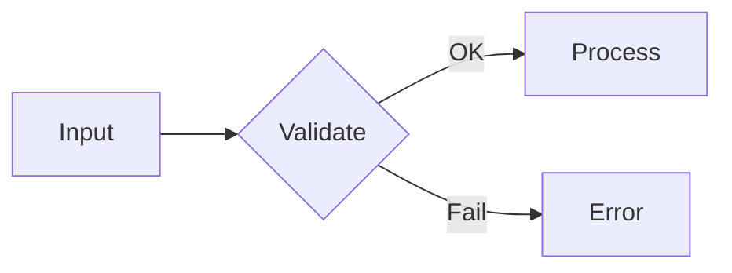

# GitHub Markdown 工具

仅当目标产物需要基础 Markdown 之外的 GitHub 组件时读取本文件，例如 alert、折叠块、徽章、Mermaid、emoji、图片深浅色变体或 Star History。

---

## Alert（告警块）
```
> [!NOTE] 有用信息
> [!TIP] 小技巧
> [!IMPORTANT] 重要提示
> [!WARNING] 小心
> [!CAUTION] 风险
```
GitHub Flavored Markdown 原生支持，渲染彩色方块。

## KBD（键盘按键）
```
按 <kbd>Ctrl</kbd> + <kbd>C</kbd> 复制
```
只对单个按键有效，组合键写多个 `<kbd>`。

## Collapse（折叠块）
```markdown
<details>
<summary>点击展开完整日志</summary>

```
错误日志内容
```

</details>
```
适合折叠长日志、配置、大段代码。
避免把 GitHub alert 块放在折叠块内部；不同渲染位置可能无法正常显示。

## Badge（徽章）

Shields.io 生成，URL 基础路径：`https://img.shields.io/`

### Badge 使用规则

- 先选意图，再生成徽章：状态、版本、许可、文档、社区入口、覆盖范围等。
- 每个徽章都要回答一个读者问题，并链接到证据页。
- 动态徽章只用于真实存在的数据源，例如包版本、release、workflow、coverage、downloads。
- 静态徽章可以表达项目载体或范围，例如 `format-SKILL.md`、`18 scenarios`，但也要链接到对应文件。
- 默认 3 到 6 个。更多徽章应分组或移到后文。
- 同一 README 内保持 style、大小写和颜色强度一致。
- 不默认添加访问量、Star History、GitHub stats、贡献图或 profile 卡片。
- 如果 shields.io 动态 badge 因数据源不存在返回 error/unknown，跳过并告知用户。不重复 badge。
- 查询参数通用：`?style=flat`（默认）| `flat-square` | `plastic` | `for-the-badge` | `social`；`&logo=`（simple-icons slug）；`&logoColor=`（颜色）；`&label=`（覆盖左侧文本）；`&labelColor=`（左侧底色）；`&color=`（右侧底色）

### Badge 摆放惯例（基于 GitHub 头部仓库调研）

| 维度 | 主流做法 | 说明 |
|------|---------|------|
| **位置** | H1 标题行 inline，或标题下方（1–4行） | React/Vue/K8s 放标题行内；TypeScript/Oh My Zsh 放标题下方独立行。不设"## Badges"小节 |
| **居中** | 有 hero/banner 区（logo + 标题 + 描述）时，用 HTML 包裹居中 | Next.js、Tailwind 用 `<p align="center">` |
| **样式** | shields.io `flat` 或 `flat-square` 默认样式 | 不使用 `for-the-badge` |
| **格式** | `[](target-url)` | 标准 Markdown 图片链接包在超链接里 |
| **数量** | 3–6 个，一行放完 | 超过 6 个时换行或分组 |
| **基础设施项目** | 通常不使用 badge | Linux、Go、Rust 官方仓库均无 badge |

**Badge 优先级顺序**（按最常见的前→后排列）：

| 优先级 | Badge | 出现频率 | 示例 |
|--------|-------|---------|------|
| 1 | **CI / Build** | 6/7 仓库排第一或第二 | GitHub Actions workflow status |
| 2 | **Package version** | 6/7 仓库使用 | npm / PyPI / Crates.io / GitHub release |
| 3 | **License** | 4/7 仓库使用 | MIT / Apache-2.0 / GPL |
| 3 | **Downloads** | 4/7 仓库使用 | npm/dm / PyPI/dm / Docker pulls |
| 5 | **Security / OpenSSF** | 3/7 仓库使用 | CII Best Practices / Scorecard |
| 6 | **Social / Community** | 2/7 仓库使用 | Discord / X / Mastodon |

对于典型开源项目，推荐 5-badge 标准集（按优先级）：**CI → Version → License → Downloads → Security/Social**

### 静态 Badge（任意文字）

```
https://img.shields.io/badge/<label>-<message>-<color>
```

编码规则：`_` 或 `%20` = 空格，`__` = `_`，`--` = `-`

示例：
```
https://img.shields.io/badge/build-passing-brightgreen
https://img.shields.io/badge/Scenarios-18-6a0dad
https://img.shields.io/badge/PRs-Welcome-brightgreen
https://img.shields.io/badge/Agent-Claude%20Code-8A2BE2
https://img.shields.io/badge/Format-Agent%20Skills-22AA66
```

### GitHub 系列

前缀：`/github/`

| Badge | URL 模式 |
|-------|----------|
| License | `/github/license/user/repo` |
| Stars | `/github/stars/user/repo` |
| Forks | `/github/forks/user/repo` |
| Watchers | `/github/watchers/user/repo` |
| Issues（总数） | `/github/issues/user/repo` |
| Open Issues（数字） | `/github/issues-raw/user/repo` |
| Closed Issues | `/github/closed-issues/user/repo` |
| PRs（总数） | `/github/issues-pr/user/repo` |
| Open PRs（数字） | `/github/issues-pr-raw/user/repo` |
| Merged PRs | `/github/merged-prs/user/repo` |
| Closed PRs | `/github/closed-prs/user/repo` |
| Discussions | `/github/discussions/user/repo` |
| Last Commit | `/github/last-commit/user/repo` |
| Commit Activity（月） | `/github/commit-activity/m/user/repo` |
| Commit Activity（年） | `/github/commit-activity/y/user/repo` |
| Latest Release | `/github/release/user/repo` |
| Release Version | `/github/v/release/user/repo` |
| Release Date | `/github/release-date/user/repo` |
| Latest Tag | `/github/v/tag/user/repo` |
| Tag | `/github/tag/user/repo` |
| Contributors | `/github/contributors/user/repo` |
| Downloads（总） | `/github/downloads/user/repo/total` |
| Downloads（Release） | `/github/downloads/user/repo/tag` |
| Workflow Status | `/github/actions/workflow/status/user/repo/workflow.yml` |
| Checks Status | `/github/checks-status/user/repo/commit-sha` |
| Repo Size | `/github/repo-size/user/repo` |
| Code Size | `/github/languages/code-size/user/repo` |
| Top Language | `/github/languages/top/user/repo` |
| Language Count | `/github/languages/count/user/repo` |
| Directory File Count | `/github/directory-file-count/user/repo` |
| Deployments | `/github/deployments/user/repo/env` |
| Milestones | `/github/milestones/user/repo` |
| Hacktoberfest | `/github/hacktoberfest/year/user/repo` |
| GitHub Sponsors | `/github/sponsors/user` |
| Followers（用户） | `/github/followers/user` |

### GitLab 系列

前缀：`/gitlab/`

| Badge | URL 模式 |
|-------|----------|
| Pipeline Status | `/gitlab/pipeline/user/repo` |
| Coverage | `/gitlab/coverage/user/repo` |
| Latest Release | `/gitlab/v/release/user/repo` |
| Last Commit | `/gitlab/last-commit/user/repo` |
| License | `/gitlab/license/user/repo` |
| Contributors | `/gitlab/contributors/user/repo` |
| Top Language | `/gitlab/languages/top/user/repo` |
| Stars | `/gitlab/stars/user/repo` |
| Forks | `/gitlab/forks/user/repo` |

### npm 系列

前缀：`/npm/`

| Badge | URL 模式 |
|-------|----------|
| Version | `/npm/v/package` |
| License | `/npm/l/package` |
| Type Definitions | `/npm/types/package` |
| Unpacked Size | `/npm/unpacked-size/package` |
| Monthly Downloads | `/npm/dm/package` |
| Weekly Downloads | `/npm/dw/package` |
| Daily Downloads | `/npm/dd/package` |
| Yearly Downloads | `/npm/dy/package` |
| Total Downloads | `/npm/dt/package` |

### PyPI 系列

前缀：`/pypi/`

| Badge | URL 模式 |
|-------|----------|
| Version | `/pypi/v/package` |
| License | `/pypi/l/package` |
| Python Versions | `/pypi/pyversions/package` |
| Wheel | `/pypi/wheel/package` |
| Implementation | `/pypi/implementation/package` |
| Format | `/pypi/format/package` |
| Status | `/pypi/status/package` |
| Monthly Downloads | `/pypi/dm/package` |
| Weekly Downloads | `/pypi/dw/package` |
| Daily Downloads | `/pypi/dd/package` |

### Docker 系列

前缀：`/docker/`

| Badge | URL 模式 |
|-------|----------|
| Version | `/docker/v/user/repo` |
| Image Size | `/docker/size/user/repo` |
| Pulls | `/docker/pulls/user/repo` |
| Stars | `/docker/stars/user/repo` |
| Automated Build | `/docker/automated/user/repo` |

### Crates.io（Rust）系列

前缀：`/crates/`

| Badge | URL 模式 |
|-------|----------|
| Version | `/crates/v/crate` |
| License | `/crates/l/crate` |
| Downloads | `/crates/d/crate` |
| Downloads（Version） | `/crates/dv/crate` |
| Crate Size | `/crates/size/crate` |

### RubyGems 系列

前缀：`/gem/`

| Badge | URL 模式 |
|-------|----------|
| Version | `/gem/v/gem` |
| Total Downloads | `/gem/dt/gem` |
| Runtime Dependencies | `/gem/rd/gem` |

### NuGet（.NET）系列

前缀：`/nuget/`

| Badge | URL 模式 |
|-------|----------|
| Version | `/nuget/v/package` |
| Total Downloads | `/nuget/dt/package` |
| Weekly Downloads | `/nuget/dw/package` |

### Packagist（PHP）系列

前缀：`/packagist/`

| Badge | URL 模式 |
|-------|----------|
| Version | `/packagist/v/user/package` |
| License | `/packagist/l/user/package` |
| PHP Version | `/packagist/php-version/user/package` |
| Monthly Downloads | `/packagist/dm/user/package` |
| Daily Downloads | `/packagist/dd/user/package` |
| Total Downloads | `/packagist/dt/user/package` |

### Hex.pm（Elixir）系列

前缀：`/hexpm/`

| Badge | URL 模式 |
|-------|----------|
| Version | `/hexpm/v/package` |
| License | `/hexpm/l/package` |
| Total Downloads | `/hexpm/dt/package` |

### Maven Central（Java）系列

前缀：`/maven-central/`

| Badge | URL 模式 |
|-------|----------|
| Version | `/maven-central/v/group/artifact` |
| Version（with label） | `/maven-central/v/group/artifact?label=Maven` |

### Visual Studio Marketplace 系列

前缀：`/visual-studio-marketplace/`

| Badge | URL 模式 |
|-------|----------|
| Version | `/visual-studio-marketplace/v/extension` |
| Installs | `/visual-studio-marketplace/i/extension` |
| Downloads | `/visual-studio-marketplace/d/extension` |
| Rating | `/visual-studio-marketplace/stars/extension` |
| Reviews | `/visual-studio-marketplace/r/extension` |

### JetBrains Plugin 系列

前缀：`/jetbrains/plugin/`

| Badge | URL 模式 |
|-------|----------|
| Version | `/jetbrains/plugin/v/pluginId` |
| Downloads | `/jetbrains/plugin/d/pluginId` |
| Rating | `/jetbrains/plugin/rating/pluginId` |
| Reviews | `/jetbrains/plugin/reviews/pluginId` |

### Homebrew 系列

前缀：`/homebrew/`

| Badge | URL 模式 |
|-------|----------|
| Version | `/homebrew/v/formula` |
| Cask Version | `/homebrew/cask/v/cask` |
| Downloads | `/homebrew/d/formula` |

### Chocolatey 系列

前缀：`/chocolatey/`

| Badge | URL 模式 |
|-------|----------|
| Version | `/chocolatey/v/package` |
| Downloads | `/chocolatey/d/package` |

### Scoop 系列

前缀：`/scoop/`

| Badge | URL 模式 |
|-------|----------|
| Version | `/scoop/v/package` |

### Snapcraft 系列

前缀：`/snap/`

| Badge | URL 模式 |
|-------|----------|
| Version | `/snap/v/package` |
| Downloads | `/snap/d/package` |

### AUR（Arch Linux）系列

前缀：`/aur/`

| Badge | URL 模式 |
|-------|----------|
| Version | `/aur/version/package` |
| License | `/aur/license/package` |
| Maintainer | `/aur/maintainer/package` |
| Votes | `/aur/votes/package` |
| Popularity | `/aur/popularity/package` |
| Last Modified | `/aur/last-modified/package` |

### Chocolatey 系列

前缀：`/winget/`

| Badge | URL 模式 |
|-------|----------|
| Version | `/winget/v/package` |
| Status | `/winget/s/package` |

### CI / Build 系列

| Badge | URL 模式 |
|-------|----------|
| CircleCI | `/circleci/build/user/repo/branch` |
| Travis CI（.com） | `/travis/.com/user/repo` |
| Travis CI（Branch） | `/travis/.com/user/repo/branch` |
| Jenkins Build | `/jenkins/s/https/jenkins.example.com/job/job` |
| Jenkins Tests | `/jenkins/tests/https/jenkins.example.com/job/job` |
| Jenkins Coverage | `/jenkins/coverage/https/jenkins.example.com/job/job` |
| AppVeyor Build | `/appveyor/build/user/repo` |
| AppVeyor Tests | `/appveyor/tests/user/repo` |
| GitHub Workflow | 见 GitHub 系列 |

### Code Coverage 系列

| Badge | URL 模式 |
|-------|----------|
| Codecov | `/codecov/c/user/repo` |
| Codecov（Branch） | `/codecov/c/user/repo/branch` |
| Coveralls | `/coveralls/user/repo` |
| Sonar Quality Gate | `/sonar/quality_gate/project` |
| Sonar Coverage | `/sonar/coverage/project` |
| Sonar Violations | `/sonar/violations/project` |
| Sonar Tech Debt | `/sonar/tech_debt/project` |
| Sonar Rating | `/sonar/rating/project` |
| Sonar Alert Status | `/sonar/alert_status/project` |

### Social / Communication 系列

| Badge | URL 模式 |
|-------|----------|
| Discord | `/discord/serverId` |
| Matrix | `/matrix/room` |
| Slack | `/slack/team/serverId` |
| Gitter | `/gitter/room/user/repo` |
| Zulip | `/zulip/topics/stream` |
| Bluesky Followers | `/bluesky/followers/user` |
| Reddit Subscribers | `/reddit/subscribers/subreddit` |
| Twitch Status | `/twitch/status/user` |
| Twitch Views | `/twitch/views/user` |
| Twitch Followers | `/twitch/followers/user` |
| YouTube Channel Views | `/youtube/channel/views/channelId` |
| YouTube Subscribers | `/youtube/channel/subscribers/channelId` |
| YouTube Video Views | `/youtube/v/videoId` |
| YouTube Likes | `/youtube/likes/videoId` |
| YouTube Comments | `/youtube/comments/videoId` |
| Twitter/X Followers | `/twitter/followers/user` |

### Funding 系列

| Badge | URL 模式 |
|-------|----------|
| GitHub Sponsors | `/github/sponsors/user` |
| Open Collective Backers | `/opencollective/backers/collective` |
| Open Collective Sponsors | `/opencollective/sponsors/collective` |
| Liberapay Receives | `/liberapay/receives/username` |
| Liberapay Patrons | `/liberapay/patrons/username` |
| Liberapay Goal | `/liberapay/goal/username` |

### Website / Monitoring 系列

| Badge | URL 模式 |
|-------|----------|
| Website Status | `/website?url=https://example.com` |
| Website Up/Down | `/website-up-down/https/example.com?label=Website` |
| Maintenance | `/maintenance/yes/year` |
| Chromium HSTS Preload | `/hsts/preload/domain` |

### 其他系列

| Badge | URL 模式 |
|-------|----------|
| Go Module | `/go/mod/module` |
| Keybase PGP | `/keybase/pgp/username` |
| Keybase BTC | `/keybase/btc/username` |
| Eclipse Marketplace Version | `/eclipse-marketplace/v/package` |
| Eclipse Marketplace Downloads | `/eclipse-marketplace/d/package` |
| Eclipse Marketplace Rating | `/eclipse-marketplace/rating/package` |
| F-Droid | `/f-droid/v/package` |
| CTAN Version | `/ctan/v/package` |
| CTAN License | `/ctan/l/package` |
| W3C Validation | `/w3c-validation/default` |
| Codacy Grade | `/codacy/grade/projectId` |
| Codacy Coverage | `/codacy/coverage/projectId` |
| Code Climate Maintainability | `/codeclimate/maintainability/user/repo` |
| Code Climate Coverage | `/codeclimate/coverage/user/repo` |
| Snyk Vulnerabilities | `/snyk/vulnerabilities/github/user/repo` |
| Dependabot | `/dependabot/user/repo` |
| LGTM Alerts | `/lgtm/alerts/g/user/repo` |
| LGTM Grade | `/lgtm/grade/python/g/user/repo` |
| Libraries.io | `/librariesio/release/npm/package` |
| Sourcegraph | `/sourcegraph/rr/user/repo` |

延伸参考：[pudding0503/github-badge-collection](https://github.com/pudding0503/github-badge-collection) 可用于查找 badge、卡片和 GitHub 视觉素材；使用具体素材前先核验来源和可用性。

## 图片深浅色变体
```markdown


```
适合 README logo、架构图或截图需要适配 GitHub 浅色/深色主题时使用。两张图应表达同一内容，避免让不同主题看到不同信息。

## Mermaid（图表）
````markdown

````
GitHub 原生渲染，支持 flowchart / sequence / class / state / gantt / pie。

## 任务列表（Checklist）
```
- [ ] 待办
- [x] 已完成
```
GitHub Issue 和 PR 模板的核心组件。

## 表格
```
| 参数 | 类型 | 必填 | 说明 |
|------|------|------|------|
| name | string | 是 | 名称 |
| age | number | 否 | 年龄 |
```
对齐符号：`:---` 左对齐、`:---:` 居中、`---:` 右对齐。

## 代码块
````markdown
```python
def hello():
    print("Hello")
```
````
指定语言触发语法高亮：`python` `javascript` `go` `bash` `diff` `yaml` 等。

## Emoji
```
:rocket: → 🚀
:bug: → 🐛
:sparkles: → ✨
:fire: → 🔥
:book: → 📖
:white_check_mark: → ✅
:wrench: → 🔧
```
GitHub 自动渲染，常用在标题、摘要、任务列表和轻量状态提示。常用 GitHub artifact emoji 见 [`emoji-guide.md`](./emoji-guide.md)。

完整 shortcode 查找：

- GitHub Docs linked Emoji-Cheat-Sheet: https://github.com/ikatyang/emoji-cheat-sheet/blob/master/README.md
- rxaviers markdown emoji markup: https://gist.github.com/rxaviers/7360908
- gitmoji commit intent guide: https://github.com/carloscuesta/gitmoji

README 默认不使用 emoji。只有用户要求、仓库已有风格如此，或项目明显偏社区/产品/教学型时才少量使用。不要给每个标题机械加 emoji；文档型、库、基础设施和企业工具默认保持克制。

## 使用建议

| 场景 | 推荐武器 |
|------|---------|
| Bug Report 描述 | 代码块 + 表格 + 日志折叠 |
| Feature Request 设计 | 代码块 + Mermaid |
| PR 说明 | Checklist + 代码块 + 截图 |
| README 快速开始 | 代码块 + Badge + 表格 + 深浅色图片 |
| README Badge 行 | GitHub 系列（license/stars/last-commit/release）+ CI + 其他按需 |
| CHANGELOG | 列表 + 表格 + emoji |
| Review 评论 | 代码块 + 引用块 |
| RFC | Mermaid + 表格 + 代码块 |
