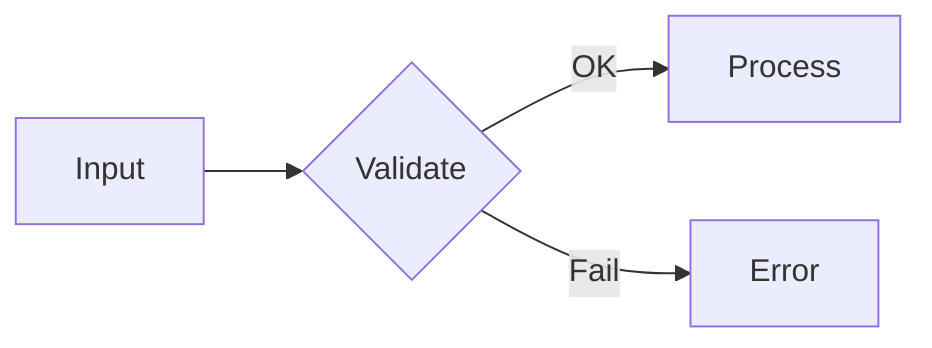

# GitHub Markdown 工具

仅当目标产物需要基础 Markdown 之外的 GitHub 组件时读取本文件，例如 alert、折叠块、徽章、Mermaid、emoji、图片深浅色变体或 Star History。

---

## Alert（告警块）
```
> [!NOTE] 有用信息
> [!TIP] 小技巧
> [!IMPORTANT] 重要提示
> [!WARNING] 小心
> [!CAUTION] 风险
```
GitHub Flavored Markdown 原生支持，渲染彩色方块。

## KBD（键盘按键）
```
按 <kbd>Ctrl</kbd> + <kbd>C</kbd> 复制
```
只对单个按键有效，组合键写多个 `<kbd>`。

## Collapse（折叠块）
```markdown
<details>
<summary>点击展开完整日志</summary>

```
错误日志内容
```

</details>
```
适合折叠长日志、配置、大段代码。
避免把 GitHub alert 块放在折叠块内部；不同渲染位置可能无法正常显示。

## Badge（徽章）

Shields.io 生成，URL 基础路径：`https://img.shields.io/`

### Badge 使用规则

- 先选意图，再生成徽章：状态、版本、许可、文档、社区入口、覆盖范围等。
- 每个徽章都要回答一个读者问题，并链接到证据页。
- 动态徽章只用于真实存在的数据源，例如包版本、release、workflow、coverage、downloads。
- 静态徽章可以表达项目载体或范围，例如 `format-SKILL.md`、`18 scenarios`，但也要链接到对应文件。
- 默认 3 到 6 个。更多徽章应分组或移到后文。
- 同一 README 内保持 style、大小写和颜色强度一致。
- 不默认添加访问量、Star History、GitHub stats、贡献图或 profile 卡片。
- 如果 shields.io 动态 badge 因数据源不存在返回 error/unknown，跳过并告知用户。不重复 badge。
- 查询参数通用：`?style=flat`（默认）| `flat-square` | `plastic` | `for-the-badge` | `social`；`&logo=`（simple-icons slug）；`&logoColor=`（颜色）；`&label=`（覆盖左侧文本）；`&labelColor=`（左侧底色）；`&color=`（右侧底色）

### Badge 摆放惯例（基于 GitHub 头部仓库调研）

| 维度 | 主流做法 | 说明 |
|------|---------|------|
| **位置** | H1 标题行 inline，或标题下方（1–4行） | React/Vue/K8s 放标题行内；TypeScript/Oh My Zsh 放标题下方独立行。不设"## Badges"小节 |
| **居中** | 有 hero/banner 区（logo + 标题 + 描述）时，用 HTML 包裹居中 | Next.js、Tailwind 用 `<p align="center">` |
| **样式** | shields.io `flat` 或 `flat-square` 默认样式 | 不使用 `for-the-badge` |
| **格式** | `[](target-url)` | 标准 Markdown 图片链接包在超链接里 |
| **数量** | 3–6 个，一行放完 | 超过 6 个时换行或分组 |
| **基础设施项目** | 通常不使用 badge | Linux、Go、Rust 官方仓库均无 badge |

**Badge 优先级顺序**（按最常见的前→后排列）：

| 优先级 | Badge | 出现频率 | 示例 |
|--------|-------|---------|------|
| 1 | **CI / Build** | 6/7 仓库排第一或第二 | GitHub Actions workflow status |
| 2 | **Package version** | 6/7 仓库使用 | npm / PyPI / Crates.io / GitHub release |
| 3 | **License** | 4/7 仓库使用 | MIT / Apache-2.0 / GPL |
| 3 | **Downloads** | 4/7 仓库使用 | npm/dm / PyPI/dm / Docker pulls |
| 5 | **Security / OpenSSF** | 3/7 仓库使用 | CII Best Practices / Scorecard |
| 6 | **Social / Community** | 2/7 仓库使用 | Discord / X / Mastodon |

对于典型开源项目，推荐 5-badge 标准集（按优先级）：**CI → Version → License → Downloads → Security/Social**

### 静态 Badge（任意文字）

```
https://img.shields.io/badge/<label>-<message>-<color>
```

编码规则：`_` 或 `%20` = 空格，`__` = `_`，`--` = `-`

示例：
```
https://img.shields.io/badge/build-passing-brightgreen
https://img.shields.io/badge/Scenarios-18-6a0dad
https://img.shields.io/badge/PRs-Welcome-brightgreen
https://img.shields.io/badge/Agent-Claude%20Code-8A2BE2
https://img.shields.io/badge/Format-SKILL.md-22AA66
```

### 详细 Badge 模式

常用 badge 足够时，直接使用上面的规则和静态 badge 示例。需要完整 shields.io URL 模式、包注册表、CI、coverage、social、funding、marketplace 或平台 badge 时，再读取 [`badge-catalog.md`](./badge-catalog.md)。

延伸参考：[pudding0503/github-badge-collection](https://github.com/pudding0503/github-badge-collection) 可用于查找 badge、卡片和 GitHub 视觉素材；使用具体素材前先核验来源和可用性。

## 图片深浅色变体
```markdown


```
适合 README logo、架构图或截图需要适配 GitHub 浅色/深色主题时使用。两张图应表达同一内容，避免让不同主题看到不同信息。

## Mermaid（图表）
````markdown

````
GitHub 原生渲染，支持 flowchart / sequence / class / state / gantt / pie。

## 任务列表（Checklist）
```
- [ ] 待办
- [x] 已完成
```
GitHub Issue 和 PR 模板的核心组件。

## 表格
```
| 参数 | 类型 | 必填 | 说明 |
|------|------|------|------|
| name | string | 是 | 名称 |
| age | number | 否 | 年龄 |
```
对齐符号：`:---` 左对齐、`:---:` 居中、`---:` 右对齐。

## 代码块
````markdown
```python
def hello():
    print("Hello")
```
````
指定语言触发语法高亮：`python` `javascript` `go` `bash` `diff` `yaml` 等。

## Emoji
```
:rocket: → 🚀
:bug: → 🐛
:sparkles: → ✨
:fire: → 🔥
:book: → 📖
:white_check_mark: → ✅
:wrench: → 🔧
```
GitHub 自动渲染，常用在标题、摘要、任务列表和轻量状态提示。常用 GitHub artifact emoji 见 [`emoji-guide.md`](./emoji-guide.md)。

完整 shortcode 查找：

- GitHub Docs linked Emoji-Cheat-Sheet: https://github.com/ikatyang/emoji-cheat-sheet/blob/master/README.md
- rxaviers markdown emoji markup: https://gist.github.com/rxaviers/7360908
- gitmoji commit intent guide: https://github.com/carloscuesta/gitmoji

README 默认不使用 emoji。只有用户要求、仓库已有风格如此，或项目明显偏社区/产品/教学型时才少量使用。不要给每个标题机械加 emoji；文档型、库、基础设施和企业工具默认保持克制。

## 使用建议

| 场景 | 推荐武器 |
|------|---------|
| Bug Report 描述 | 代码块 + 表格 + 日志折叠 |
| Feature Request 设计 | 代码块 + Mermaid |
| PR 说明 | Checklist + 代码块 + 截图 |
| README 快速开始 | 代码块 + Badge + 表格 + 深浅色图片 |
| README Badge 行 | GitHub 系列（license/stars/last-commit/release）+ CI + 其他按需 |
| CHANGELOG | 列表 + 表格 + emoji |
| Review 评论 | 代码块 + 引用块 |
| RFC | Mermaid + 表格 + 代码块 |
