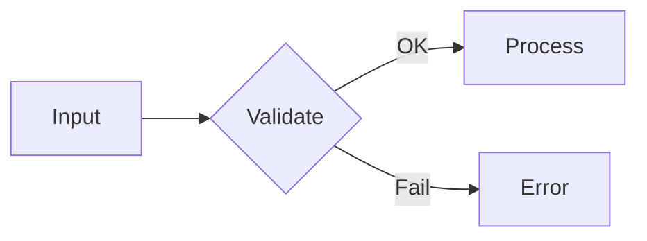

# 格式化武器库

可在任意场景按需启用。默认仅基础 markdown（段落、代码块、列表、标题）。
需要更多武器时，告诉你要用的武器名即可。

---

## Alert（告警块）
```
> [!NOTE] 有用信息
> [!TIP] 小技巧
> [!IMPORTANT] 重要提示
> [!WARNING] 小心
> [!CAUTION] 风险
```
GitHub Flavored Markdown 原生支持，渲染彩色方块。

## KBD（键盘按键）
```
按 <kbd>Ctrl</kbd> + <kbd>C</kbd> 复制
```
只对单个按键有效，组合键写多个 `<kbd>`。

## Collapse（折叠块）
```markdown
<details>
<summary>点击展开完整日志</summary>

```
错误日志内容
```

</details>
```
适合折叠长日志、配置、大段代码。
避免把 GitHub alert 块放在折叠块内部；不同渲染位置可能无法正常显示。

## Badge（徽章）
```


```
shields.io 生成，可以在 README 顶部拼成徽章栏。常见标签：npm / build / license / coverage / downloads / docs / discussions。

Badge 使用规则：

- 先选意图，再生成徽章：状态、版本、许可、文档、社区入口、覆盖范围。
- 每个徽章都要回答一个读者问题，并链接到证据页。
- 动态徽章只用于真实存在的数据源，例如包版本、release、workflow、coverage、downloads。
- 静态徽章可以表达项目载体或范围，例如 `format-SKILL.md`、`18 scenarios`，但也要链接到对应文件。
- 默认 3 到 6 个。更多徽章应分组或移到后文。
- 同一 README 内保持 style、大小写和颜色强度一致。
- 不默认添加访问量、Star History、GitHub stats、贡献图或 profile 卡片。新增这些视觉组件前先问用户；更新 README 中已有的 Star History 链接时，可直接按当前仓库 `owner/repo` 修正。

延伸参考：[pudding0503/github-badge-collection](https://github.com/pudding0503/github-badge-collection) 可用于查找 badge、卡片和 GitHub 视觉素材；使用具体素材前先核验来源和可用性。

## 图片深浅色变体
```markdown


```
适合 README logo、架构图或截图需要适配 GitHub 浅色/深色主题时使用。两张图应表达同一内容，避免让不同主题看到不同信息。

## Mermaid（图表）
````markdown

````
GitHub 原生渲染，支持 flowchart / sequence / class / state / gantt / pie。

## 任务列表（Checklist）
```
- [ ] 待办
- [x] 已完成
```
GitHub Issue 和 PR 模板的核心组件。

## 表格
```
| 参数 | 类型 | 必填 | 说明 |
|------|------|------|------|
| name | string | 是 | 名称 |
| age | number | 否 | 年龄 |
```
对齐符号：`:---` 左对齐、`:---:` 居中、`---:` 右对齐。

## 代码块
````markdown
```python
def hello():
    print("Hello")
```
````
指定语言触发语法高亮：`python` `javascript` `go` `bash` `diff` `yaml` 等。

## EMOJI
```
:rocket: → 🚀
:bug: → 🐛
:sparkles: → ✨
:fire: → 🔥
:book: → 📖
:white_check_mark: → ✅
:wrench: → 🔧
```
GitHub 自动渲染，常用在标题或摘要。完整列表：[gist markdown-emoji](https://gist.github.com/rxaviers/7360908)。

README 默认不使用 emoji。只有用户要求、仓库已有风格如此，或项目明显偏社区/产品/教学型时才少量使用。不要给每个标题机械加 emoji；文档型、库、基础设施和企业工具默认保持克制。

## 使用建议

| 场景 | 推荐武器 |
|------|---------|
| Bug Report 描述 | 代码块 + 表格 + 日志折叠 |
| Feature Request 设计 | 代码块 + Mermaid |
| PR 说明 | Checklist + 代码块 + 截图 |
| README 快速开始 | 代码块 + Badge + 表格 + 深浅色图片 |
| CHANGELOG | 列表 + 表格 + emoji |
| Review 评论 | 代码块 + 引用块 |
| RFC | Mermaid + 表格 + 代码块 |
