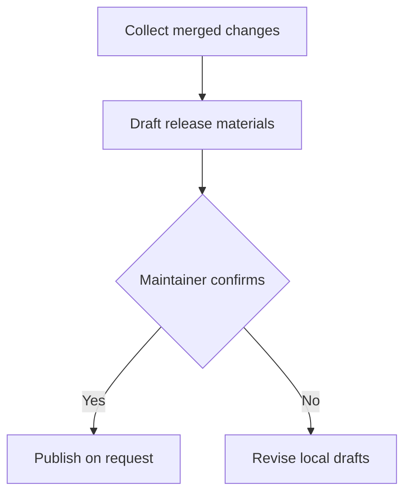

# Mermaid Diagram Standard

## Use When

Read this reference before adding a Mermaid flowchart, sequence diagram, state diagram, or architecture diagram to a GitHub artifact.

Use a diagram only when it makes a process, dependency, lifecycle, decision, or interaction easier to understand than a short list. Do not use Mermaid as decoration or a README hero graphic.

## Choose the Smallest Useful Diagram

| Need | Diagram |
| --- | --- |
| Ordered steps or decisions | `flowchart` |
| Interactions over time between named participants | `sequenceDiagram` |
| Lifecycle and valid transitions | `stateDiagram-v2` |
| High-level components and dependencies | `flowchart` with grouped subgraphs only when necessary |

Prefer prose or a table when the content is a simple list, comparison, checklist, or fewer than three relationships.

## Evidence Boundary

Every node, edge, branch, state, and participant must come from user input, repository files, a diff, configuration, or verified tool output.

- Do not invent services, approval stages, security checks, release gates, retries, owners, or failure paths.
- Mark an uncertain branch as `To confirm` only when it is necessary to explain an actual open decision.
- Explain the flow in prose before or after the diagram; readers must not need the rendered diagram as the only source of critical instructions.

## GitHub-Compatible Authoring

- Use a fenced `mermaid` block and one diagram declaration per block.
- Use short identifiers and quoted labels when labels include punctuation.
- Keep labels concise, usually one line and action-oriented.
- Prefer standard syntax over custom CSS, HTML labels, external links, or renderer-specific extensions.
- Keep a diagram to roughly 6-12 nodes and 15 edges unless the user explicitly needs a larger architecture map.
- Split independent flows instead of creating a dense all-in-one diagram.

## Good Output Shape

The release draft remains local until maintainer confirmation.

The `Publish on request` step is not performed automatically.

## Common Failure

- A flowchart repeats a short bullet list without adding a relationship or decision.
- A diagram claims a CI gate, owner approval, or release step that repository evidence does not establish.
- Labels contain paragraphs, nested Markdown, unescaped punctuation, or renderer-specific HTML.
- A large diagram hides a critical migration or release instruction that should remain visible in prose.

## Checklist

- [ ] Diagram type matches the information shape.
- [ ] Nodes and edges are evidence-backed.
- [ ] Diagram is small enough to read in GitHub's renderer.
- [ ] Critical instructions also appear in prose.
- [ ] Mermaid fence and syntax are complete.
